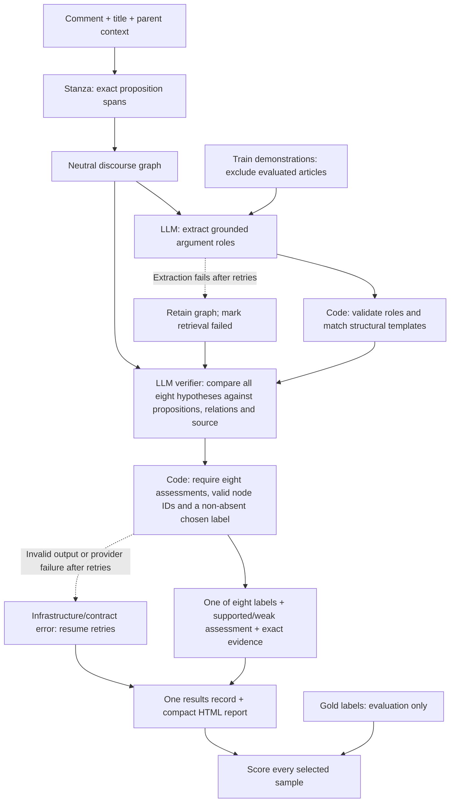

# CoCoLoFa Unified Multi-Perspective Reasoning

This repo contains the original multi-perspective CoCoLoFa method and a separate code-first discourse graph classifier for the eight-label classification task.

The code-first Stanza discourse graph classifier, compact HTML inspection report,
coverage checks and direct/rule baselines are documented in
[docs/discourse_classification.md](docs/discourse_classification.md).

## Discourse classification pipeline (v5.0)



Every successful verification selects one of the eight labels. Weak support is
an assessment, never an abstention or ninth label. Matched templates guide
verification but cannot exclude a label that retrieval missed. Code materializes
final evidence from proposition IDs, so the verifier never copies quotes or
counts offsets. There are two logical model requests per sample; legacy recovery
is off. Provider failures remain explicit errors rather than fabricated labels.

```powershell
python -m pip install -r requirements-discourse.txt
python -m scripts.prepare_classification_data
python -m scripts.discourse_classification --download-models
python -m scripts.discourse_classification --config configs/discourse_classification_test_v50.yaml --input data/cocolofa/classification/role_validation_eight.json --split train --output classification-validation-v50-check
python -m scripts.discourse_classification --config configs/discourse_classification_test_v50.yaml --output classification-test-v50-full
```

The test configuration uses four concurrent samples with serialized Stanza
parsing and a single results writer. Credentials come from `.env`. Inspect
`report.html` and `metrics.json`; add `--resume` to retry failed items with the
same config and code version. Use a fresh output name after code changes.

Historical full test v4.5: 244/481 correct (50.73% accuracy, 0.5872 macro-F1),
157 unresolved and 3 errors after retries. This failure motivated v5.0; small
regression successes do not establish benchmark performance. Template ranking
replay cannot measure graph contribution in the new verifier architecture;
that requires an actual verifier run without relations.

## Data

Use the upstream CoCoLoFa repository at pinned commit `c39d45fdd57401e1f6cb674f25113dfa0304e734`. The tracked dataset state is only `data/cocolofa/provenance.json`; `train.json`, `dev.json`, and `test.json` are prepared locally and ignored by Git.

```powershell
python scripts/prepare_data.py
python scripts/verify_dataset.py --data-dir data/cocolofa
```

## Environment

Copy `.env.example` to `.env` and set `NVIDIA_API_KEY`. For Hugging Face,
replace `HF_TOKEN=hf_replace_me` with your token; it is optional for the public
`all-mpnet-base-v2` model. The induction commands load `.env` automatically.

```powershell
cp .env.example .env
python -m pip install -r requirements.txt
```

## Run

```powershell
python -m src.run --config configs/detection.yaml --split dev --limit 1 --output smoke
python -m src.run --config configs/classification.yaml --split dev --limit 1 --output smoke-classification
```

For a true single-LLM zero-shot baseline (one model request per sample, with no
analysts, conflict resolution, or arbiter), run:

```powershell
python -m src.single_llm --config configs/single_llm_detection.yaml --split test --output detection-test-single-llm
python -m src.single_llm --config configs/single_llm_classification.yaml --split test --output classification-test-single-llm
```

Runs are written under `runs/`. Each run contains `manifest.json`, `metrics.json`, `samples.csv`, readable YAML traces under `traces/`, and API metadata under `audit/api_calls.jsonl`. Raw API dumps are disabled unless `TRACE_RAW_API=1`.

## Method

The flow uses three independent initial analysts:

- `structure`: inferential form and mandatory slots
- `goal`: argument function and discourse ownership
- `counterargument`: strongest objection versus strongest defense

Candidate dossiers preserve every proposed and contested interpretation without pairwise elimination. Detection always compares them against an explicit `Non-Fallacious` hypothesis in one final call. Classification shortcuts only a unanimous uncontested singleton; disagreements and recovery use the same comparative adjudicator. There is no voting protocol or resolver tournament.

## Metrics

Detection reports accuracy, positive-class precision/recall/F1, false positive rate, false negative rate, and a confusion matrix. Classification reports accuracy, macro-F1 over all eight CoCoLoFa labels, per-label scores, and an 8x8 confusion matrix.

## Tests

```powershell
pytest -q
```

## Semantic definition induction

The induction pipeline starts from all positive training examples of one label,
asks the configured LLM to rewrite each argument as a natural-language
`canonical_reasoning` abstraction, and embeds only that field with
`sentence-transformers/all-mpnet-base-v2`. Each successful semantic record keeps
only `sample_id`, `original_text`, and `canonical_reasoning`; the canonical text
must preserve the premise, inferential bridge, conclusion, and direction without
mechanically replacing every noun with an uppercase token. The pipeline then
discovers audited reasoning modes with cosine k-medoids. It does not induce the
complement label `none` in this phase.

Old verbose semantic records are stale artifacts. Resume removes them and asks
the configured LLM for fresh minimal records; the code does not invent a local
semantic migration.

The configured `.env` must provide the names from `configs/induction.yaml`
(`NVIDIA_API_KEY`, `NVIDIA_BASE_URL`, and `NVIDIA_MODEL` by default). Keys are
never written to artifacts. Run each stage explicitly so the semantic and
cluster hard gates are visible:

```powershell
python -m scripts.semantic_extract --config configs/induction.yaml --resume
python -m scripts.audit_semantics --config configs/induction.yaml
python -m scripts.embed_reasoning --config configs/induction.yaml
python -m scripts.cluster_search --config configs/induction.yaml
python -m scripts.audit_clusters --config configs/induction.yaml
python -m scripts.induce_cluster_modes --config configs/induction.yaml --resume
python -m scripts.induce_definition --config configs/induction.yaml
```

Or run the hard-gated sequence:

```powershell
python -m scripts.run_induction --config configs/induction.yaml --resume
```

Artifacts are written below `outputs/<label>/`: data stats and positive
samples, resumable semantic records/failures, semantic and cluster audits,
normalized embeddings, k-search metrics, cluster assignments, modes, merge
plan, induced definition, and a secret-free run manifest. A mock transport is
for plumbing tests only; a real experiment requires real LLM credentials and
the Hugging Face model to load successfully.
